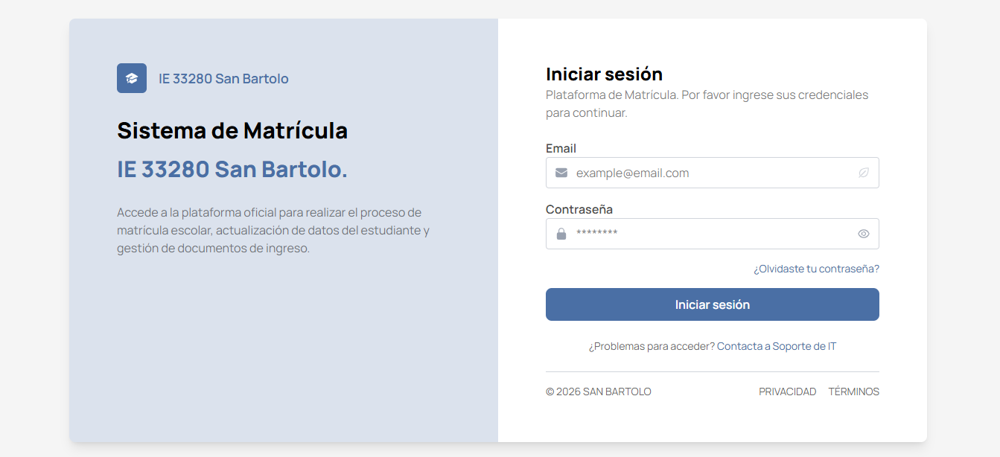
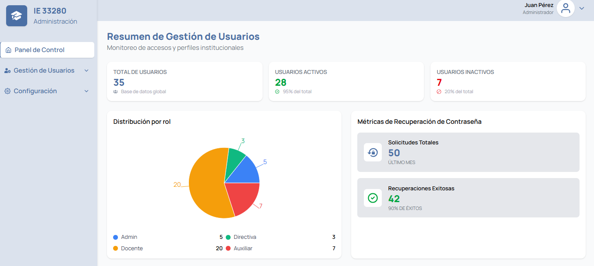
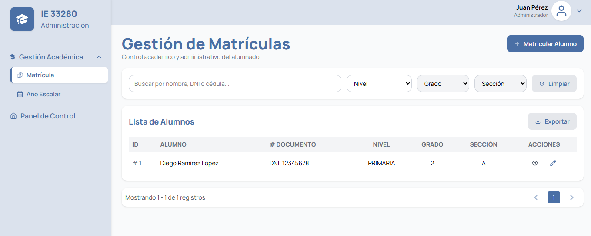
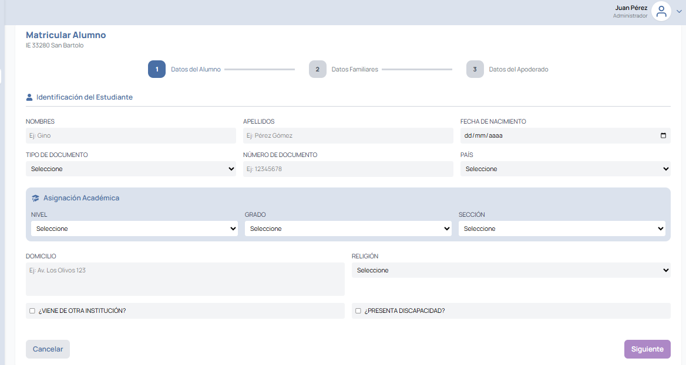
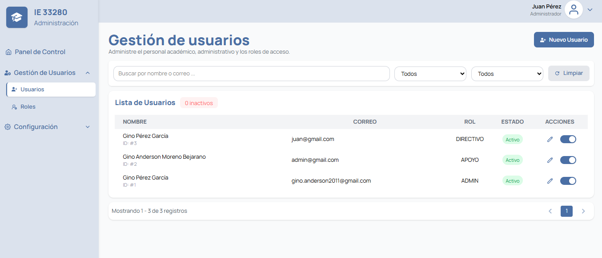

# 🎓 Sistema de Matrícula Escolar — Frontend

Aplicación web para la **gestión integral del proceso de matrícula escolar**, desarrollada con **React, TypeScript y Vite**.

El sistema permite administrar matrículas, estudiantes, usuarios, roles, periodos escolares y diferentes catálogos utilizados durante el proceso académico. Cuenta además con autenticación, control de acceso, recuperación de contraseña, dashboards y generación de documentos relacionados con la matrícula.

---

## 🚀 Características

### 🔐 Autenticación y seguridad

* Inicio de sesión mediante credenciales.
* Autenticación basada en tokens JWT.
* Protección de rutas privadas.
* Control de acceso según roles.
* Cierre de sesión.
* Recuperación de contraseña.
* Cambio de contraseña.
* Manejo centralizado de errores de autenticación.

### 👨‍🎓 Gestión de matrículas

* Registro de estudiantes.
* Registro de información familiar.
* Registro de contactos adicionales.
* Proceso de matrícula mediante formulario **multistep**.
* Consulta y filtrado de matrículas.
* Visualización del detalle de matrícula.
* Consulta de estudiantes matriculados.
* Generación de documentos relacionados con la matrícula.
* Impresión de matrícula y compromiso.

### 👤 Gestión de usuarios

* Listado de usuarios.
* Creación de usuarios.
* Edición de usuarios.
* Activación y desactivación de usuarios.
* Asignación y gestión de roles.
* Filtrado de usuarios.

### ⚙️ Gestión administrativa

El sistema permite administrar diferentes catálogos y configuraciones:

* Países.
* Tipos de documento.
* Religiones.
* Roles.
* Periodos escolares.
* Estados.

Cada módulo cuenta con operaciones de consulta, creación y actualización según corresponda.

### 📊 Dashboards

Incluye dashboards diferenciados para los diferentes perfiles del sistema, con:

* Indicadores principales.
* Estadísticas.
* Distribución de información.
* Métricas de recuperación.
* Gráficos de roles.
* Últimas matrículas registradas.

---

## 📸 Capturas de pantalla

### 🔐 Inicio de sesión



### 📊 Dashboard administrativo



### 🎓 Gestión de matrículas



### 📝 Registro de matrícula



### 👤 Gestión de usuarios



---

## 🛠️ Tecnologías utilizadas

| Tecnología   | Uso                           |
| ------------ | ----------------------------- |
| React        | Desarrollo de la interfaz     |
| TypeScript   | Tipado estático               |
| Vite         | Build y desarrollo            |
| Axios        | Comunicación con la API REST  |
| React Router | Navegación y rutas protegidas |
| CSS          | Estilos de la aplicación      |
| Docker       | Contenerización y despliegue  |
| JWT          | Autenticación mediante tokens |

---

## 🏗️ Arquitectura del proyecto

El proyecto está organizado por responsabilidades, separando la comunicación con la API, lógica reutilizable, páginas, componentes, tipos y utilidades.

```text
src/
├── api/
│   ├── service/
│   │   ├── academic/
│   │   ├── auth/
│   │   ├── country/
│   │   ├── document/
│   │   ├── password-recovery/
│   │   ├── religion/
│   │   ├── role/
│   │   ├── school-year/
│   │   ├── state/
│   │   ├── tuition/
│   │   └── usuario/
│   ├── axios.ts
│   └── endpoints.ts
│
├── components/
│   ├── AppToast.tsx
│   ├── EmptyState.tsx
│   ├── ErrorState.tsx
│   ├── Loader.tsx
│   ├── Navbar.tsx
│   └── Pagination.tsx
│
├── hooks/
│   ├── academic/
│   ├── auth/
│   ├── country/
│   ├── document/
│   ├── password-recovery/
│   ├── religion/
│   ├── role/
│   ├── school-year/
│   ├── state/
│   ├── tuition/
│   └── user/
│
├── layouts/
│   └── MainLayout.tsx
│
├── pages/
│   ├── country/
│   ├── dashboard/
│   ├── dashboard-admin/
│   ├── document/
│   ├── recovery-password/
│   ├── religion/
│   ├── role/
│   ├── school-year/
│   ├── tuition/
│   ├── user/
│   ├── Login.tsx
│   └── NotFound.tsx
│
├── routes/
│   ├── AppRouter.tsx
│   ├── NavigationHandler.tsx
│   ├── ProtectedRoute.tsx
│   └── navigation.ts
│
├── type/
│   ├── academic/
│   ├── country/
│   ├── document/
│   ├── religion/
│   ├── role/
│   ├── school-year/
│   ├── state/
│   ├── tuition/
│   └── user/
│
├── utils/
│   ├── validations/
│   ├── auth.ts
│   ├── toast.ts
│   └── token.ts
│
├── App.tsx
└── main.tsx
```

### 📁 Organización por capas

**`api/`**
Contiene la configuración de Axios, endpoints y servicios encargados de comunicarse con el backend.

**`hooks/`**
Contiene hooks personalizados para encapsular la lógica de consulta, creación, actualización y gestión de estados.

**`pages/`**
Contiene las vistas principales de cada módulo del sistema.

**`components/`**
Contiene componentes reutilizables como loaders, paginación, estados vacíos, mensajes y navegación.

**`routes/`**
Gestiona el sistema de navegación, rutas protegidas y control de acceso.

**`type/`**
Contiene las interfaces y tipos TypeScript utilizados por los diferentes módulos.

**`utils/`**
Contiene utilidades generales, autenticación, manejo de tokens, notificaciones y validaciones.

---

## 📋 Requisitos

Antes de ejecutar el proyecto necesitas tener instalado:

* Node.js 18+
* npm 9+
* Git

Además, debes tener disponible el **backend de la aplicación** para que el frontend pueda realizar las peticiones a la API.

---

## ⚙️ Instalación

### 1. Clonar el repositorio

```bash
git clone https://github.com/GinoAMB/MatriculaFrontend.git
```

### 2. Ingresar al proyecto

```bash
cd matricula-frontend
```

### 3. Instalar dependencias

```bash
npm install
```

### 4. Configurar las variables de entorno

Crea un archivo `.env` a partir del archivo `.env.example`:

```bash
cp .env.example .env
```

En Windows también puedes crear manualmente el archivo `.env` en la raíz del proyecto.

Configura la URL del backend según el entorno:

```env
VITE_API_URL=http://localhost:8080
```

> La URL debe coincidir con la dirección donde se encuentre ejecutándose la API backend.

---

## ▶️ Ejecución en desarrollo

Ejecuta:

```bash
npm run dev
```

La aplicación estará disponible normalmente en:

```text
http://localhost:5173
```

---

## 🏗️ Compilar para producción

Para generar la versión optimizada:

```bash
npm run build
```

Los archivos generados estarán disponibles en:

```text
dist/
```

Para comprobar la compilación:

```bash
npm run preview
```

---

## 🐳 Ejecución con Docker

El proyecto incluye un `Dockerfile` para facilitar su ejecución mediante contenedores.

### Construir la imagen

```bash
docker build -t matricula-frontend .
```

### Ejecutar el contenedor

```bash
docker run -p 5173:80 matricula-frontend
```

Luego accede a:

```text
http://localhost:5173
```

---

## 🔄 Comunicación con el Backend

El frontend utiliza **Axios** para comunicarse con la API REST.

La configuración central se encuentra en:

```text
src/api/axios.ts
```

Los endpoints se centralizan en:

```text
src/api/endpoints.ts
```

Los servicios se organizan por módulo:

```text
src/api/service/
├── academic/
├── auth/
├── country/
├── document/
├── password-recovery/
├── religion/
├── role/
├── school-year/
├── state/
├── tuition/
└── usuario/
```

Esta organización permite mantener separada la lógica de comunicación con el backend y facilita el mantenimiento y escalabilidad del proyecto.

---

## 🔒 Manejo de autenticación

La aplicación utiliza tokens para mantener la sesión del usuario.

El flujo principal es:

```text
Usuario
   │
   ▼
Login
   │
   ▼
Backend
   │
   ▼
JWT Token
   │
   ▼
Almacenamiento del token
   │
   ▼
Peticiones autenticadas
   │
   ▼
API REST
```

Las rutas privadas se protegen mediante:

```text
src/routes/ProtectedRoute.tsx
```

Mientras que las funciones relacionadas con autenticación y tokens se encuentran en:

```text
src/utils/auth.ts
src/utils/token.ts
```

---

## 🧩 Módulos principales

```text
┌─────────────────────────────────────┐
│       Sistema de Matrícula          │
├─────────────────────────────────────┤
│                                     │
│  🔐 Autenticación                   │
│  👨‍🎓 Matrículas                     │
│  👤 Usuarios                        │
│  🎭 Roles                           │
│  📅 Periodos escolares              │
│  🌎 Países                          │
│  📄 Documentos                      │
│  🛐 Religiones                      │
│  📊 Dashboards                      │
│                                     │
└─────────────────────────────────────┘
```

---

## 📱 Flujo de matrícula

El registro de una matrícula se divide en diferentes pasos para facilitar el ingreso de información:

```text
Inicio
  │
  ▼
Datos del estudiante
  │
  ▼
Información familiar
  │
  ▼
Contacto adicional
  │
  ▼
Validación
  │
  ▼
Registro de matrícula
  │
  ▼
Generación de documentos
```

Este proceso se implementa mediante componentes reutilizables dentro de:

```text
src/pages/tuition/components/multiStep/
```

---

## 📄 Generación de documentos

El módulo de matrícula incorpora componentes orientados a la impresión de documentos:

* Matrícula.
* Compromiso.
* Lista de alumnos.

Estos componentes se encuentran en:

```text
src/pages/tuition/components/
```

---

## 🧪 Scripts disponibles

```bash
npm run dev       # Ejecutar servidor de desarrollo
npm run build     # Compilar para producción
npm run preview   # Previsualizar build de producción
```

---

## 📌 Buenas prácticas aplicadas

* Componentes reutilizables.
* Separación de responsabilidades.
* Hooks personalizados.
* Servicios independientes por módulo.
* Tipado mediante TypeScript.
* Rutas protegidas.
* Centralización de endpoints.
* Validación de formularios.
* Manejo de estados de carga y error.
* Manejo centralizado de notificaciones.
* Organización modular por dominio.

---

## 🔗 Backend

Este proyecto funciona como cliente frontend de una API REST desarrollada independientemente.

**Backend:** Spring Boot / Java

La comunicación se realiza mediante HTTP utilizando endpoints REST y autenticación mediante JWT.

---

## 👨‍💻 Autor

**Gino Anderson Moreno Bejarano**

Desarrollador Full Stack Junior

* GitHub: [GinoAMB](https://github.com/GinoAMB)
* LinkedIn: [Gino Moreno Bejarano](https://www.linkedin.com/in/ginomorenobejarano/)

---

## 📄 Licencia

Este proyecto fue desarrollado con fines educativos y profesionales.
